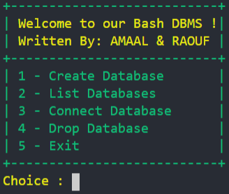
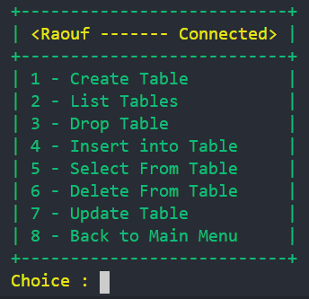
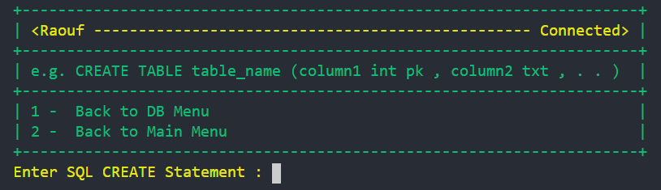
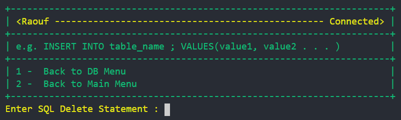
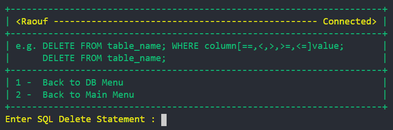
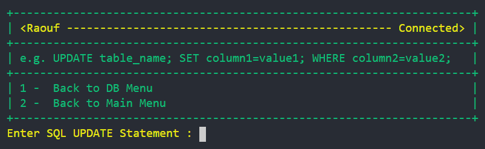
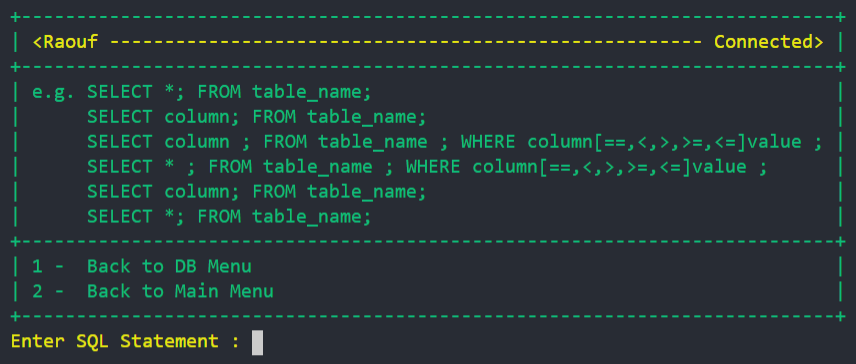

# Bash DBMS
Implementation of a Database Management System using Bash Script


<p align="center">
  
</p>


# Main Features 
The Program has both CLI & GUI Interfaces
* CLI With SQL Statements
* Simple GUI using Zenity

# CLI Main Menu

From the Main menu you can do the following :
* Create Database
* List Datebases
* Connect Database
* Drop Database  
#### You must create at least one Database to Connect.

# Connect Database Menu

After Creating a Database you can do the following :
* Create Table 
* Drop Tables
* Insert into Table
* Select From Table
* Delete From Table
* Update Table
#### You must create at least one table to use these options, you get Error message if table not exist.

<p align="center">
  
</p>

# Key Features
## CREATE With SQL Statement 
```
CREATE TABLE table_name (column1 int pk , column2 txt , . . )
```
1. Supported data types : int , txt 
2. Only one Primary Key is permitted
3. Descriptive Error message

<p align="center">
  
</p>

## INSERT With SQL statement  
```
INSERT INTO tableName ; VALUES(value1, value2 . . . )
```
1. You must enter the values in the columns order
2. Primary Key cannot be null or duplicated
3. The values must match the column data type
4. Descriptive Error message

<p align="center">
  
</p>

## DELETE With SQL Statements  
```
DELETE FROM table_name; WHERE column[==,<,>,>=,<=]value;  
DELETE FROM table_name; 
```
1. The where column must exist
2. Supported where operators [==,<,>,>=,<=]
3. Descriptive Error message

<p align="center">
  
</p>

## UPDATE With SQL Statement 
```
UPDATE table_name; SET column1=value1; WHERE column2=value2;
```
1. The SET column and must exist
2. The SET value must match the column data type
3. The WHERE column must exist
4. Primary Key cannot be null or duplicated
5. Descriptive Error message

<p align="center">
  
</p>

## SELECT With SQL Statements 
```
SELECT *; FROM table_name;
SELECT column; FROM table_name;
SELECT column ; FROM table_name ; WHERE column[==,<,>,>=,<=]value ;
SELECT * ; FROM table_name ; WHERE column[==,<,>,>=,<=]value ;
SELECT column; FROM table_name;
SELECT *; FROM table_name; 
```
1. The SELECT column must exist
3. The WHERE column must exist
4. Supported WHERE operators [==,<,>,>=,<=]
5. Descriptive Error message

<p align="center">
  
</p>

---


 


